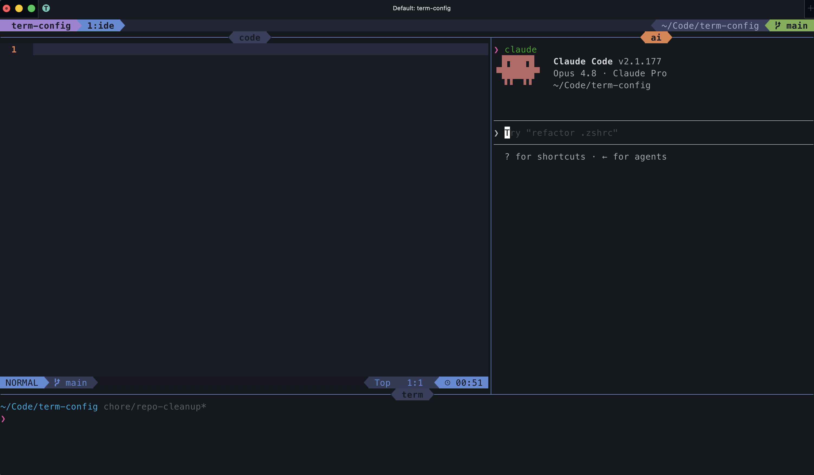
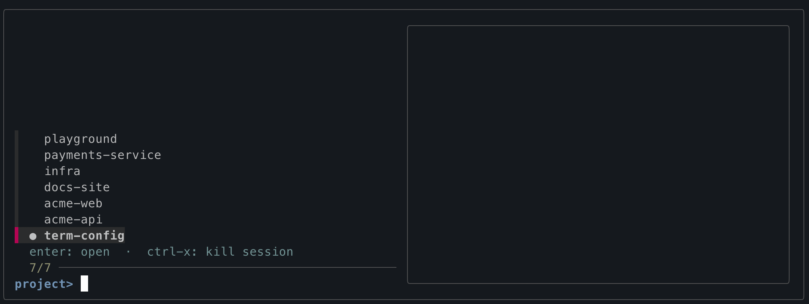
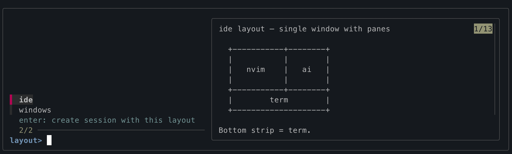

# term-config

**An efficient, low-overhead development environment for the age of AI agents.**

term-config turns your terminal into a project workspace manager. Instead of
running a separate heavyweight IDE — each with its own embedded terminal and its
own AI assistant — for every repo you touch, you get **one terminal tab per
project**, with everything that project needs grouped in one place: a
[LazyVim](https://github.com/LazyVim/LazyVim) editor, a dedicated Claude Code
session, and as many terminal panes as you need for running and debugging.

The result: a clean desktop, a sane way to navigate between projects, and a
fraction of the RAM — because every project lives in a single tmux session
sharing one lightweight Neovim + shell stack, not N Electron windows.



## Why

Modern AI-assisted development pushes you toward one IDE window per project, each
spawning its own editor process, language servers, integrated terminal, and AI
panel. Five projects open means five of everything and a cluttered dock.

term-config takes the opposite approach:

- **One tab, one project.** A tmux session per repo holds the editor, the AI
  agent, and your terminals together — switch projects by switching sessions,
  not by alt-tabbing between IDE windows.
- **The AI agent lives with the code.** Each project gets its own Claude Code
  session in its own pane, so you manage agents per-project without juggling
  windows.
- **Light on memory.** tmux + Neovim + a shell is a tiny footprint next to a
  stack of Electron IDEs. Run more projects on the same machine.
- **Keyboard-first and consistent.** The same keybindings, prompt, and tools
  everywhere — no per-IDE config drift.

## The project workspace

`tp` is the entry point. Run it with no arguments to fuzzy-pick from your project
directories and any running sessions; it opens (or attaches to) a tmux session
for that project.

```sh
tp           # fuzzy-pick a project or running session
tp .         # use the current directory
tp <path>    # use a specific path
```



When a session doesn't exist yet, `tp` asks which **layout** to use, with a live
preview of each:

| Layout | What you get |
|--------|--------------|
| **`ide`** | One window, three panes: Neovim (large, left), Claude (right), terminal (bottom) — the screenshot above. |
| **`windows`** | Three separate windows — `code` (Neovim), `ai` (Claude), `term` — switch with `prefix + 1/2/3` or `prefix + e/i/o`. |



Set `TP_LAYOUT=ide` (or `windows`) to skip the prompt.

Helper commands inside a project session:

| Command | Purpose |
|---------|---------|
| `trun [name]` | Run a named config from a project's `.trun` file in its own stable window (JetBrains-style run configs), or `trun -- <cmd>` for an ad-hoc command. |
| `tterm` | Add another terminal window (`term`, `term-2`, …). |
| `tlayout [ide\|windows]` | Convert the current session between layouts — running processes are preserved. |
| `tnew [name]` | Start a plain scratch session, outside the project workflow. |

A project `.trun` file (one config per line) defines run tasks:

```
frontend: npm run dev
backend:  go run ./cmd/server
test:     go test ./...
```

## Features

**Shell (zsh)**
- [powerlevel10k](https://github.com/romkatv/powerlevel10k) prompt, [antidote](https://github.com/mattmc3/antidote) plugin manager
- [atuin](https://github.com/atuinsh/atuin) (`Ctrl-r` history), [zoxide](https://github.com/ajeetdsouza/zoxide) (`z`/`zi`), [fzf](https://github.com/junegunn/fzf) + fzf-tab completion
- Modern CLI swaps: [`eza`](https://github.com/eza-community/eza) (`ls`/`ll`), [`bat`](https://github.com/sharkdp/bat) (`cat`), [`lazygit`](https://github.com/jesseduffield/lazygit) (`lg`)

**tmux**
- `C-Space` prefix, mouse on, vi copy mode, status bar on top with a Tokyo Night Powerline theme
- Seamless `Ctrl-hjkl` navigation between Neovim splits and tmux panes ([smart-splits.nvim](https://github.com/mrjones2014/smart-splits.nvim))
- The `tp`/`trun`/`tterm`/`tlayout`/`tnew` workspace tooling above

**Neovim ([LazyVim](https://github.com/LazyVim/LazyVim))**
- Full IDE feature set: LSP, completion, treesitter, git signs, lint, fuzzy finding
- Project picker (`<Space>fp`), Trouble diagnostics, Overseer task runner
- See [`nvim/.config/nvim/CHEATSHEET.md`](nvim/.config/nvim/CHEATSHEET.md) for the full keymap

## Bootstrap a new mac

```sh
git clone <this-repo> ~/Code/term-config
cd ~/Code/term-config
./install.sh
```

`install.sh` does **not** overwrite your `~/.zshrc` or tmux config. It appends a
small managed block to each (marked with `# >>> term-config >>>`) that sources
the repo files straight from this checkout and adds `zsh/.local/bin` to your
`PATH`. Anything you already have in those files is preserved — delete the marked
block to detach. Only the Neovim config (a complete config this repo owns) is
symlinked (with plain `ln`, no extra tooling) into `~/.config/nvim/`.

The script installs Homebrew (if missing), runs `brew bundle`, installs NVM,
wires the references into your config, and symlinks the Neovim config. Re-run it
anytime — it's idempotent, and re-running updates the managed blocks in place
(useful if you move the repo).

After install: open a new terminal, then run `nvim` once to let LazyVim bootstrap
its plugins. Set your terminal font to **MesloLGS Nerd Font** so the prompt and
Powerline glyphs render.

## Uninstall

```sh
cd ~/Code/term-config
./uninstall.sh           # detach from your machine
./uninstall.sh --brew    # also uninstall the Brewfile packages
```

`uninstall.sh` removes the managed block from `~/.zshrc` and the tmux config
(preserving your own settings), drops the leftover symlinks and the Neovim config
symlinks, and deletes the generated plugin cache. Homebrew, the Brewfile
packages, and NVM are shared tooling and are left in place unless you pass
`--brew`.

## Configuration

### Project search roots

Two pickers scan your project directories — currently via **separate** env vars:

| Picker | Variable | Format | Default |
|--------|----------|--------|---------|
| `tp` (tmux) | `CODE_DIRS` | space-separated | `~/Code ~/Code-Safad` |
| nvim `<Space>fp` | `DEV_DIRS` | colon-separated (like `$PATH`) | `~/Code` |

Set them in your `~/.zshrc` (install never overwrites it), or in `~/.zshrc.local`
(see below):

```sh
export CODE_DIRS="$HOME/Code $HOME/Work"
export DEV_DIRS="$HOME/Code:$HOME/Work"
```

### Local overrides (optional)

install.sh never touches your `~/.zshrc`, so machine-specific env vars can simply
go there. If you'd rather keep them in a separate file — handy for secrets or for
settings you don't want in a tracked dotfiles repo — `term-config.zsh` sources
`~/.zshrc.local` if it exists:

```sh
echo 'export MY_VAR=value' >> ~/.zshrc.local
```

## Refreshing

```sh
brew upgrade                 # latest CLI tools
nvim +':Lazy sync' +qa       # latest nvim plugins (commits the lock refresh)
git add nvim/.config/nvim/lazy-lock.json && git commit -m "chore: refresh nvim plugins"
```

`lazy-lock.json` is committed so a fresh laptop reproduces *exactly* what works
today. `:Lazy sync` is how you pull upstream drift on your schedule.

## Adding a tool

Add a line to `Brewfile` and re-run `./install.sh`. Keep project-specific tooling
(databases, cloud SDKs, language SDKs) out of here — install those per project.

## Generating the screenshots

The fuzzy-finder screenshot is captured against a throwaway set of demo repos so
no personal projects are shown:

```sh
# create demo project roots
mkdir -p /tmp/demo-projects && cd /tmp/demo-projects
for p in acme-api acme-web payments-service infra docs-site term-config playground; do
  mkdir -p "$p" && git -C "$p" init -q
done

# point the picker at them and run it, then screenshot the fzf list
CODE_DIRS="/tmp/demo-projects" tp
```

Save the capture as `assets/picker.png` and uncomment the image line in
[The project workspace](#the-project-workspace) above. Remove `/tmp/demo-projects`
when done.

## Credits

`nvim/.config/nvim/` is based on the [LazyVim starter](https://github.com/LazyVim/starter)
([Apache License 2.0](nvim/.config/nvim/LICENSE)), modified for this setup.
